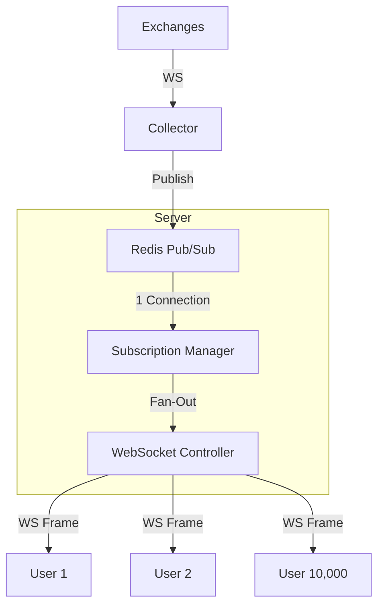

# hackathon-trade

This project was created with [Better-T-Stack](https://github.com/AmanVarshney01/create-better-t-stack), a modern TypeScript stack that combines React, TanStack Router, Elysia, and more.

## Features

- **TypeScript** - For type safety and improved developer experience
- **TanStack Router** - File-based routing with full type safety
- **TailwindCSS** - Utility-first CSS for rapid UI development
- **shadcn/ui** - Reusable UI components
- **Elysia** - Type-safe, high-performance framework
- **Bun** - Runtime environment
- **Prisma** - TypeScript-first ORM
- **PostgreSQL** - Database engine
- **Authentication** - Better-Auth
- **Turborepo** - Optimized monorepo build system

## Getting Started

First, install the dependencies:

```bash
bun install
```

## Database Setup

This project uses PostgreSQL with Prisma.

1. Make sure you have a PostgreSQL database set up.
2. Update your `apps/server/.env` file with your PostgreSQL connection details.

3. Generate the Prisma client and push the schema:

```bash
bun run db:push
```

Then, run the development server:

```bash
bun run dev
```

Open [http://localhost:3001](http://localhost:3001) in your browser to see the web application.
The API is running at [http://localhost:3000](http://localhost:3000).

## Ticker System Architecture

The project implements a high-performance, scalable real-time ticker system designed to handle thousands of concurrent users efficiently.

### Core Components

1.  **Collector** (`modules/ticker/collectors/`):

    - Connects to external exchanges (Binance, KuCoin) via WebSocket.
    - Normalizes data into a standard `Candle` format.
    - Pushes updates to Redis.

2.  **Redis Layer** (`modules/ticker/ticker.redis.service.ts`):

    - Acts as the central message broker.
    - **Pub/Sub:** Broadcasts live price updates.
    - **KV Store:** Caches the latest candle for immediate snapshots on page load.

3.  **Subscription Manager** (`modules/ticker/ticker.subscription-manager.service.ts`):
    - **The Scalability Engine.** Implements a Singleton pattern to multiplex Redis subscriptions.
    - **Fan-Out Mechanism:** Maintains a single Redis connection for a symbol (e.g., `BTCUSDT`) regardless of how many thousands of users subscribe to it.
    - Distributes the single Redis message to all local WebSocket clients.

### Data Flow



### Key Scalability Features

- **Multiplexing:** 10,000 users subscribing to `BTC` = **1 Redis Connection**.
- **Delta Updates:** WebSocket only sends the specific symbol that changed, minimizing bandwidth.
- **Horizontal Scaling:** Stateless architecture allows adding more server nodes behind a load balancer without code changes.

## 🔒 OKX WebSocket Proxy Rules (MANDATORY)

OKX WebSocket traffic is geo-blocked in local environments. The following rules MUST be followed:

### Local execution (`NODE_ENV=development` or `local`):

- OKX WebSocket MUST use a SOCKS5 proxy via AWS EC2.
- Proxy MUST be provided via `LOCAL_OKX_PROXY`.
- Application MUST fail fast if the proxy is missing or unreachable.

### Production / EC2 execution:

- Proxy usage is STRICTLY FORBIDDEN.
- OKX WebSocket MUST connect directly.

### Health enforcement:

- On startup, the application MUST verify proxy reachability.
- If the proxy cannot reach OKX, the process MUST terminate with a clear error.
- Silent fallback is NOT allowed.

**Local setup (required):**

```bash
ssh -i ec2.pem -D 1080 -N -C ec2-user@EC2_IP
export NODE_ENV=development
export LOCAL_OKX_PROXY=socks5://127.0.0.1:1080
```

## Project Structure

```
hackathon-trade/
├── apps/
│   ├── web/         # Frontend application (React + TanStack Router)
│   └── server/      # Backend API (Elysia)
├── packages/
│   ├── api/         # API layer / business logic
│   ├── auth/        # Authentication configuration & logic
│   └── db/          # Database schema & queries
```

## Available Scripts

- `bun run dev`: Start all applications in development mode
- `bun run build`: Build all applications
- `bun run dev:web`: Start only the web application
- `bun run dev:server`: Start only the server
- `bun run check-types`: Check TypeScript types across all apps
- `bun run db:push`: Push schema changes to database
- `bun run db:studio`: Open database studio UI

# hackathon-trade
